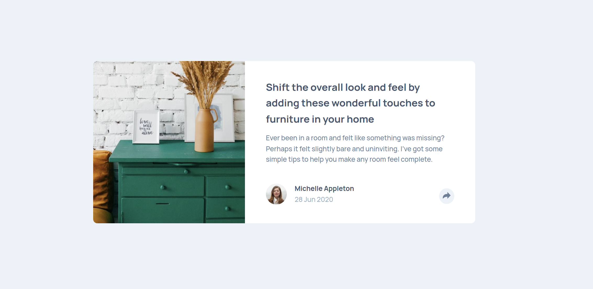

# Frontend Mentor - Article preview component solution

This is a solution to the [Article preview component challenge on Frontend Mentor](https://www.frontendmentor.io/challenges/article-preview-component-dYBN_pYFT). Frontend Mentor challenges help you improve your coding skills by building realistic projects. 

### The challenge

Users should be able to:

- View the optimal layout for the component depending on their device's screen size
- See the social media share links when they click the share icon

## Links

- [View Code](https://github.com/Bayoura/article-preview-component)
- [Live Demo](https://bayoura.github.io/article-preview-component/)

## Built with

- HTML
- CSS
- Flexbox
- CSS Grid
- Mobile-first workflow

## What I learned
- How to make those social media share links (to position those can be annoying). Especially the little triangle of the desktop pop-up took some tinkering.
- I used `button` tags to enclose the `img` tags for the icons to make them keyboard-focusable. To make those buttons accessible (since their only content are the images) I used the `alt` attributes.
- I used an invisible overlay so the user would be able to close the desktop pop-up by clicking anywhere on the page. You have to use the z-index so that the share button and the icons are still clickable.

## Author

- [codepen](https://codepen.io/bayoura)
- [GitHub](https://github.com/Bayoura)
- [Frontend Mentor](https://www.frontendmentor.io/profile/Bayoura)